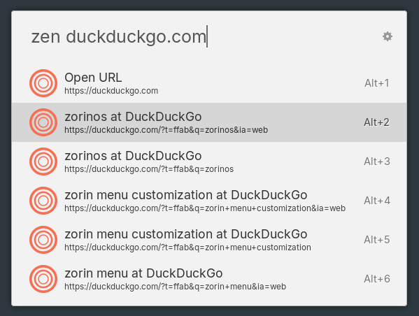

# Ulauncher Zen Browser Search

Simple [Ulauncher](https://ulauncher.io) extension for searching bookmarks and history in Zen Browser.



*Recommendation: If you like the icons in the screenshot, I'm using the [Tela-circle-icon-theme](https://github.com/vinceliuice/Tela-circle-icon-theme) on my machine!*

## Installation

### Via Ulauncher Interface
1. Open Ulauncher Settings -> Extensions -> Add extension.
2. Paste the following URL:
   `https://github.com/claudiosanches/ulauncher-zen-browser`
3. Click **Add**.

### Manual Installation (Developer Version)
1. Open a terminal.
2. Create the Ulauncher extensions directory if it doesn't exist:
   ```bash
   mkdir -p ~/.local/share/ulauncher/extensions
   ```
3. Clone this repository into the extensions folder:
   ```bash
   git clone https://github.com/claudiosanches/ulauncher-zen-browser ~/.local/share/ulauncher/extensions/com.github.claudiosanches.ulauncher-zen-browser
   ```
4. Restart Ulauncher.

## Features

- Search through Zen Browser history and bookmarks.
- Open URLs directly with automatic `https://` detection.
- Supports both OS (`~/.zen`) and Flatpak (`~/.var/app/app.zen_browser.zen/.zen`) installations.
- Customizable search types and results ordering.

## Settings

In Ulauncher GUI, you can set the following preferences:

- **Keyword**: Keyword to trigger the extension (defaults to `zen`).
- **Search Type**: Choose between searching Bookmarks, History, or both.
- **History Sorting**: Select the sorting criteria for history results:
  - **Relevance (Frecency)**: (Recommended) Uses the [Mozilla Frecency algorithm](https://developer.mozilla.org/en-US/docs/Mozilla/Tech/Places/Frecency_algorithm) to rank results based on how often and how recently you visit them.
  - **Visit count**: Most visited pages first.
  - **Last visit**: Most recently visited pages first.
- **Result Limit**: Maximum number of suggested items to display.

## Usage

Open Ulauncher and type in the set up keyword (defaults to `zen`). 

- **Search**: Provide a search query to browse your browser's history and bookmarks.
- **Open URL**: Provide a valid URL (e.g., `duckduckgo.com` or `https://github.com`) to open it directly.

To open the selected item, press **Enter**. You can also copy the URL to your input by pressing **ALT + ENTER**.

## Troubleshooting

If the extension cannot find your Zen Browser data, ensure it is installed in one of the following locations:
- `~/.zen/`
- `~/.var/app/app.zen_browser.zen/.zen/`

The extension expects a `profiles.ini` file in these directories to locate your browsing data.

## Credits

This project is based on and inspired by the [Ulauncher Firefox Launcher](https://github.com/freisatz/ulauncher-firefox-launcher/) by freisatz.

## License

This project is licensed under the terms of the GPLv3 license. See the [LICENSE](LICENSE) file for details.
